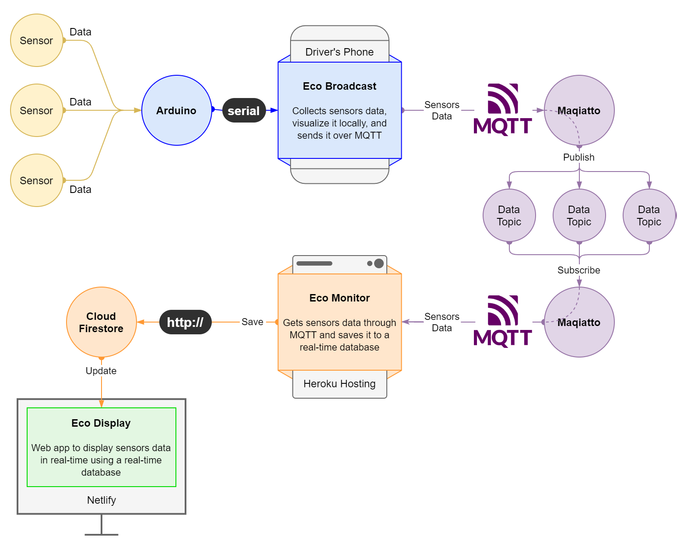

# Eco-Broadcast

**Eco-Broadcast** is the start point for [Cairo University Eco Racing Team](https://www.facebook.com/ShellEcoMarathonCUT) telemetry system (so-called _Eco-Telemetry_).

## Role in Eco-Telemetry

Collects sensors data and sends it over MQTT to [Eco-Monitor](https://github.com/adhammo/eco-monitor) which saves it in ([Cloud Firestore](https://firebase.google.com/docs/firestore)) to be displayed in real-time using [Eco-Monitor](https://github.com/adhammo/eco-display).

## Arduino code
```arduino
#define pot A0
#define led 5

void setup() {
  Serial.begin(9600);
  while (!Serial) {}

  pinMode(led, OUTPUT);
}

void loop() {
  int reading = analogRead(pot);
  analogWrite(led, map(reading, 0, 1023, 0, 255));
  
  byte reading_l = reading & 255;
  byte reading_h = (reading >> 8) & 255;
  Serial.write(reading_l);
  Serial.write(reading_h);
  delay(100);
}
```

# Eco-Telemetry

A system to collect and send sensors data over the internet to be displayed and monitored in real-time.



## Eco-Telemetry description

An arduino collects and sends sensors data through serial to [Eco-Broadcast](https://github.com/adhammo/eco-broadcast) which in turn sends it through an MQTT Broker ([Maqiatto.com](https://www.maqiatto.com/)) to [Eco-Monitor](https://github.com/adhammo/eco-monitor) which saves it to a real-time database ([Cloud Firestore](https://firebase.google.com/docs/firestore)) which updates, on change, [Eco-Display](https://github.com/adhammo/eco-display) where the data can be seen in real-time.
